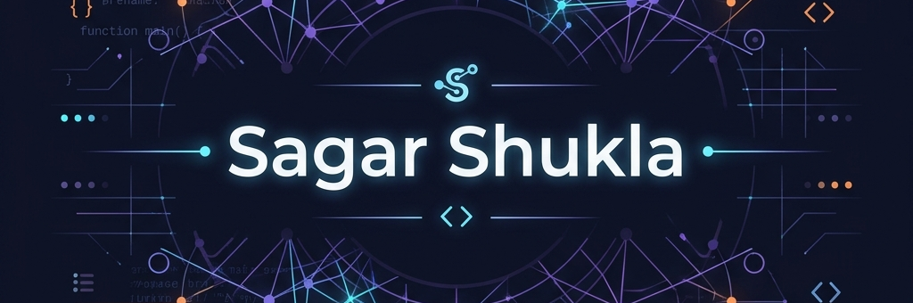

<!-- Horizontal Banner -->
<div align="center">
  
</div>

<br>

<!-- Typing Animation -->
<div align="center">
  
</div>

<div align="center">
  <a href="https://www.linkedin.com/in/sagar-shukla-33b409249/"></a>
  <a href="mailto:shuklasagar201003@gmail.com"></a>
</div>


## 👨🏻‍💻 About Me

```yaml
sagar_shukla:
  current_role: "M.Tech Student in AI & ML @ COEP Technological University"
  academic_background:
    masters: "M.Tech in AI & ML @ COEP Technological University (Pursuing)"
    bachelors: "B.E. in Computer Engineering (Specialization in AI & ML)"
  core_focus: ["Computer Vision", "RAG", "GenAI (GAN)", "Deep Learning"]
  passions: ["Building Intelligent Systems", "Exploring & Experimenting with New AI Models", "Open Source Dev"]
```

I am a deep learning and artificial intelligence specialist focused on bridging the gap between theoretical models and real-world deployable solutions. My work ranges from building autonomous multi-drone surveillance networks using YOLO architectures to implementing hot-swappable domain knowledge systems for LLMs.


## 💻 Tech Stack & Tools

<table align="center" width="100%">
  <tr>
    <td width="33.3%" align="center" valign="top">
      <h4>🐍 Languages</h4>
      <a href="https://skillicons.dev">
        
      </a>
    </td>
    <td width="33.3%" align="center" valign="top">
      <h4>🔥 AI & Machine Learning</h4>
      <a href="https://skillicons.dev">
        
      </a>
    </td>
    <td width="33.3%" align="center" valign="top">
      <h4>🛠️ Frameworks & DevOps</h4>
      <a href="https://skillicons.dev">
        
      </a>
    </td>
  </tr>
</table>


## 📁 Featured Projects

<table align="center" width="100%">
  <tr>
    <td width="50%" valign="top" align="center">
      <a href="https://github.com/Sagar201003/NeuralNexus_PB2_THE-SME-PLUG">
        
      </a>
      <p align="left"><i>Hot-swappable Subject Matter Expert plugin for LLMs utilizing a hybrid RAG pipeline (HyDE, BM25, ChromaDB) and agentic workflows to eliminate hallucinations.</i></p>
      <p align="left">
        
        
        
        
      </p>
    </td>
    <td width="50%" valign="top" align="center">
      <a href="https://github.com/Sagar201003/SkySentinel">
        
      </a>
      <p align="left"><i>IoV-Integrated Autonomous Multi-Drone Swarm surveillance system. Leverages YOLOv11-Pose, GATs, Voronoi Tessellation, and a PyQt6 ground control station.</i></p>
      <p align="left">
        
        
        
        
      </p>
    </td>
  </tr>
  <tr>
    <td width="50%" valign="top" align="center">
      <a href="https://github.com/Sagar201003/YOLO-GCN-Surveillance">
        
      </a>
      <p align="left"><i>A state-of-the-art Computer Vision architecture built on PyTorch and YOLOv8-pose. Extracts 17-point skeletal anatomy natively into a sliding Graph Convolutional Network (GCN) to classify real-time suspicious human activities.</i></p>
      <p align="left">
        
        
        
        
      </p>
    </td>
    <td width="50%" valign="top" align="center">
      <a href="https://github.com/Sagar201003/SARNet">
        
      </a>
      <p align="left"><i>End-to-end deep learning pipeline translating grayscale Synthetic Aperture Radar (SAR) imagery into colorized optical imagery using CycleGAN, with an integrated ResNet-18 terrain classifier.</i></p>
      <p align="left">
        
        
        
        
      </p>
    </td>
  </tr>
</table>


## 🏆 Achievements & Publications

- 🥇 **Best Project Award** for *SkySentinel* (PCUBE 2025, FCRIT).
- 🥈 **2nd Rank** in Hack Hurricane 1.0 (48-hour National Hackathon by PHICSIT).
- 📜 **Published Paper:** *"Autonomous Criminal Identification System"* in GRENZE International Journal of Engineering and Technology, 2024.
- 🏅 **National Level Competitor** at the Srinivasa Ramanujan Mathematical Competition.
- 🎙️ **Speaker** at college AIML training sessions, educating peers on core machine learning concepts.

<br>
<div align="center">
  <a href="https://github.com/ryo-ma/github-profile-trophy">
    
  </a>
</div>


## 📊 GitHub Analytics

<p align="center">
  <a href="https://github.com/Sagar201003">
    
  </a>
  <a href="https://github.com/Sagar201003">
    
  </a>
</p>

<p align="center">
  <a href="https://github.com/Sagar201003">
    
  </a>
</p>

<br>

<p align="center">
  <picture>
    <source media="(prefers-color-scheme: dark)" srcset="https://raw.githubusercontent.com/Sagar201003/Sagar201003/output/github-contribution-grid-snake-dark.svg">
    <source media="(prefers-color-scheme: light)" srcset="https://raw.githubusercontent.com/Sagar201003/Sagar201003/output/github-contribution-grid-snake.svg">
    
  </picture>
</p>

<br>

<div align="center">
  
</div>